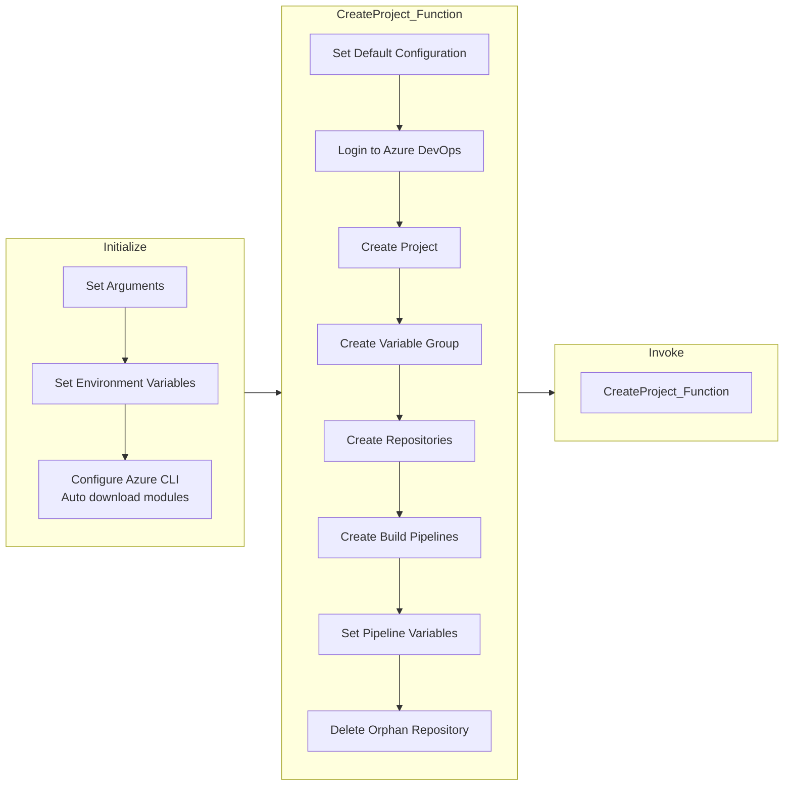

# AzureDevopsProjectCreator
This scripts creates a Azure DevOps project with required objects within the project.

Usage command : ```powershell .\AzureDevopsProjectCreator.ps1 -ProjectName "TestProject" -Description "This is a test project" -PAT "YOURPATSTRING" -organization "https://dev.azure.com/ORGANIZATION" ```

Read more about this in the UiPath Forum.


